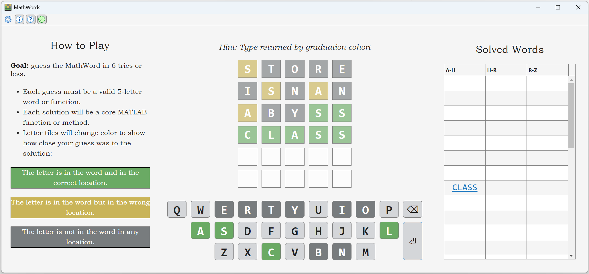

# MathWords Puzzle Game
Play the popular word guessing game with your favorite 5-letter [MATLAB® functions](https://www.mathworks.com/help/matlab/referencelist.html?type=function&listtype=alpha)!

This code demonstrates how to implement a MATLAB® app using the Model-View-Controller (MVC) software architecture pattern. To learn more, please see ["Developing MATLAB Apps Using the Model-View-Controller Pattern"](https://www.mathworks.com/company/technical-articles/developing-matlab-apps-using-the-model-view-controller-pattern.html) on the MathWorks webpage.



## How To Play
**Goal:** Guess the MathWord in 6 tries or less.
* Each guess must be a valid 5-letter word or function.
* Each solution will be a core MATLAB® function or method.
* Letter tiles will change color to show how close your guess was to the solution:
    * 🟩 The letter is in the word and in the correct location.
    * 🟨 The letter is in the word but in the wrong location.
    * ⬛ The letter is not in the word in any location.

## App Interface

The MathWords app can be launched using `LaunchMathWords.m`:
```
>> LaunchMathWords;
```

### Toolbar
* 🔄 Press the refresh button to get a "New MathWord".
* ℹ️ Press the information button to show/hide the "How to Play" panel.
* ❔ Press the question mark button to show/hide a cryptic, crossword-style hint.
* ✅ Press the green check mark to show/hide the "Solved Words" panel.

### Keyboard
* 🔠 Use your mouse or touchscreen to press keyboard letter buttons.
* ⌫ Press the backspace button to delete the most recent letter.
* ⏎ Press the enter button to submit your 5-letter guess.
